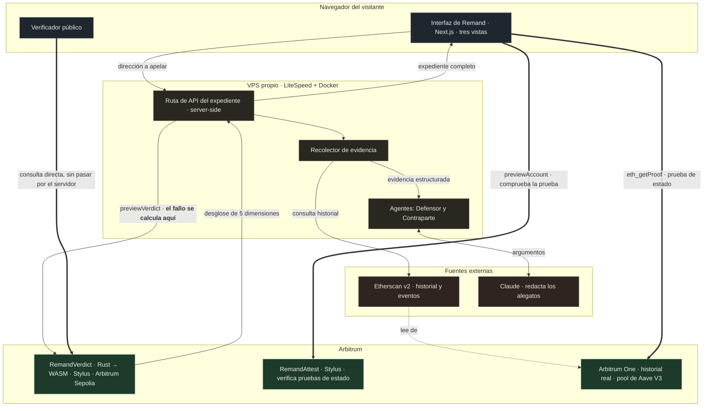
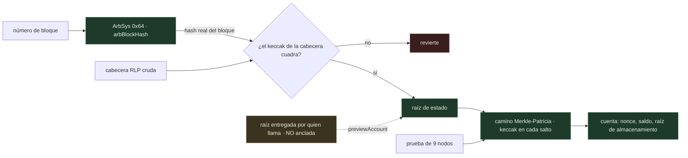
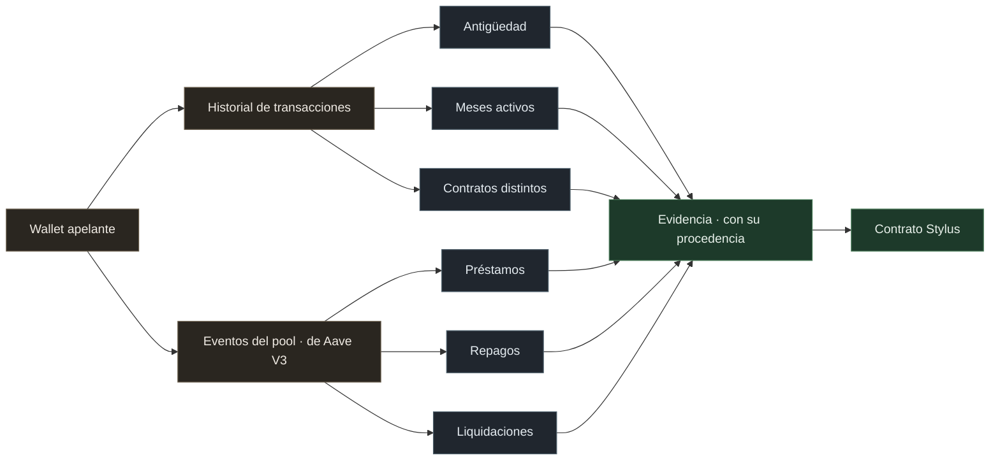
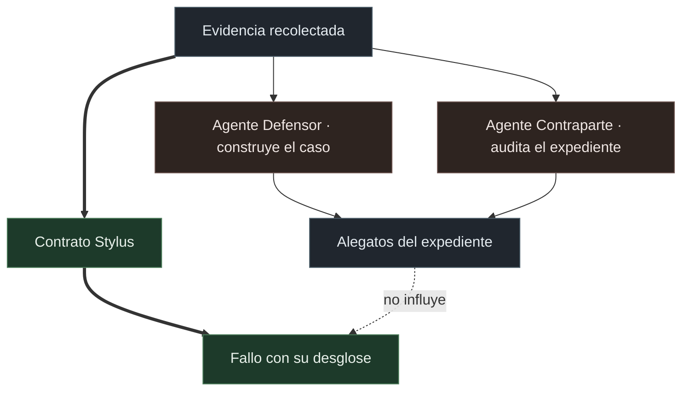
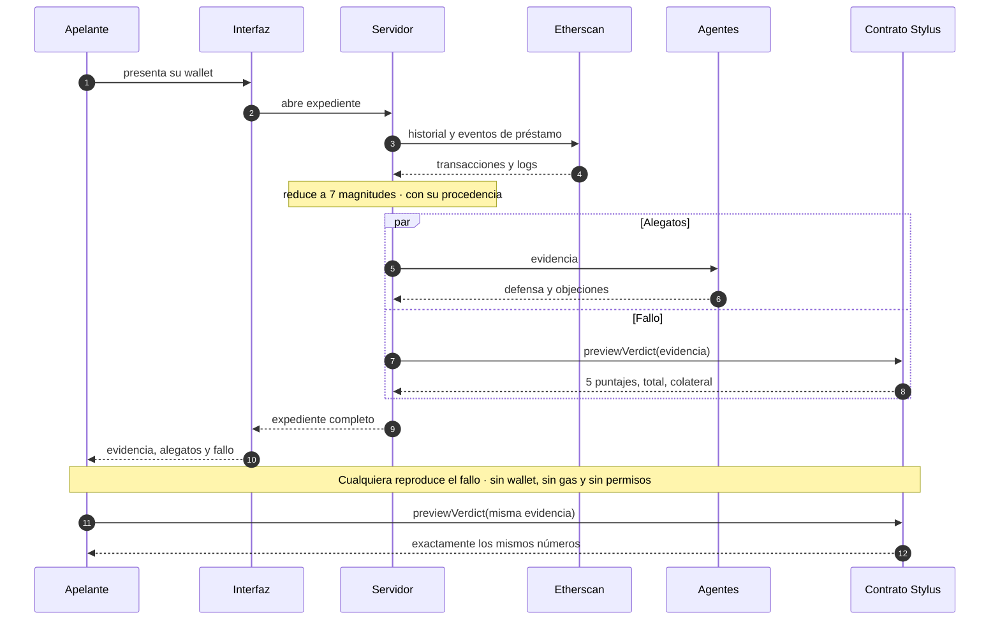
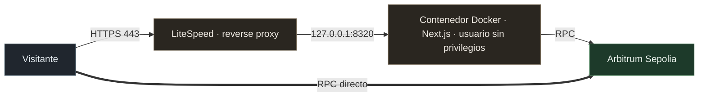

# Arquitectura de Remand

Remand reabre una solicitud de crédito rechazada, reúne la evidencia de
comportamiento que la primera instancia ignoró, y **recalcula el fallo dentro de
un contrato en Arbitrum**. El desglose completo queda escrito en la cadena y
cualquiera puede reproducirlo.

La decisión que gobierna todo el diseño es una sola: **el fallo lo computa el
contrato, no el servidor y no los agentes**. Todo lo demás se acomoda a eso.

---

## Vista general

Las flechas gruesas son la tesis del proyecto. El verificador público habla con
Arbitrum **directamente desde el navegador del visitante**, sin pasar por
nuestro servidor. Si la verificación dependiera de nosotros, no sería
verificación.

Las otras dos salen del mismo sitio y cierran el circuito por el otro extremo:
el navegador pide la prueba de estado a un nodo público de Arbitrum One y se la
entrega al atestador, que la comprueba dentro de la cadena. Ni el servidor ni la
interfaz tocan ese camino.

---

## El atestador de estado

`RemandAttest`, en `0xce27abc23d456b2dce24967b669624569c396448`, existe para
responder la pregunta que sigue a la anterior. El contrato del fallo prueba la
aritmética: es una función pura y cualquiera la reproduce. Pero eso no dice nada
sobre los números que entran, y un motor honesto con datos inventados sigue
dando un resultado inventado.

La salida barata sería un oráculo firmado, o sea pedir que se confíe en quien
firma. Este contrato no firma nada.

El punto de anclaje es `arbBlockHash` del precompilado ArbSys. Importa la
distinción: el opcode `BLOCKHASH` del EVM, dentro de Nitro, devuelve un
pseudoaleatorio que no sirve como prueba. `arbBlockHash` devuelve el hash real
de los últimos 256 bloques. Con él, un contrato puede comprobar por su cuenta
que una cabecera es auténtica, sacar la raíz de estado, y caminar una prueba de
Merkle-Patricia verificando el keccak de cada nodo hasta llegar a la cuenta.

### Las dos entradas, y cuál usa la demo hoy

La flecha punteada del diagrama es la parte que conviene mirar de frente, porque
es donde la afirmación se sostiene sobre menos de lo que parece.

`arbBlockHash` devuelve hashes **de la cadena donde vive el contrato**. El
atestador está desplegado en Arbitrum Sepolia, así que sólo puede anclar bloques
de Sepolia. La evidencia del expediente, en cambio, sale de Aave V3 en Arbitrum
One. Un contrato en Sepolia no tiene forma de comprobar por su cuenta que una
cabecera de Arbitrum One sea auténtica.

De ahí que el contrato exponga dos entradas distintas:

| Función | Origen de la raíz | Confianza que exige |
|---|---|---|
| `anchor` + `verifyAccount` | la comprueba contra `arbBlockHash` | ninguna, dentro de su cadena |
| `previewAccount` | la recibe como parámetro | hay que fiarse de quien la entrega |

**La demo usa `previewAccount` contra Arbitrum One.** La verificación de la
prueba de Merkle es completa y real, con su keccak comprobado en cada salto, así
que una prueba manipulada revierte. Lo que no está anclado es la raíz misma: si
quien llama mintiera sobre ella, la prueba cuadraría contra una raíz falsa.

Dicho de otro modo, hoy el atestador demuestra que **un nonce dado pertenece a un
estado dado**, y el bucle completo sin confianza queda demostrado sobre Sepolia,
que es donde el contrato puede anclar. Cerrar el hueco no exige rediseñar nada:
es desplegar el mismo binario en Arbitrum One, donde `anchor` pasaría a anclar
bloques de Arbitrum One y las dos mitades se juntarían.

Así lee el **nonce de una cuenta ajena**, que es el número de transacciones que
esa wallet ha firmado. Ningún opcode del EVM lee el nonce de otra cuenta.

La llamada es de lectura pura: sin gas y sin firma. El expediente la usa para
partir sus ocho campos de evidencia en tres clases y para comprobar una cota que
la cadena puede desmentir: **una wallet no puede haber hecho más operaciones que
transacciones ha firmado.**

| Clase | Campos | De dónde sale |
|---|---|---|
| Probado en cadena | 1 | prueba de estado verificada por el contrato |
| Recalculable | 3 | bisección sobre el contador de transacciones |
| Declarado | 4 | conteo de eventos desde un índice de terceros |

Cuatro de ocho siguen dependiendo de un tercero, y el producto lo dice en su
propia pantalla. El anclaje sin confianza alcanza 256 bloques, unos 64 segundos,
así que cubre el estado reciente y no el historial: por eso la antigüedad es
recalculable y no probada.

Detalles de implementación en [CONTRACTS.md](CONTRACTS.md). El lector de RLP y
el caminante de trie están escritos a mano, sin dependencias, y rechazan
codificaciones no canónicas: aceptar ceros a la izquierda daría dos codificaciones
válidas para la misma cabecera, o sea dos hashes para un mismo bloque.

---

## Las tres capas

### 1. Contrato Stylus, el único que falla

`packages/stylus/contracts/remand-verdict/`

| Archivo | Responsabilidad |
|---|---|
| `evidence_schema.rs` | Qué evidencia se acepta y cuándo se rechaza por incoherente |
| `verdict_engine.rs` | Motor determinista. Función pura, sin estado ni reloj |
| `lib.rs` | Contrato: registra apelaciones, emite fallos, expone la vista pública |

El motor pondera cinco dimensiones y publica el desglose completo:

| Dimensión | Peso | Qué mide |
|---|---|---|
| Historial de repago | 30% | Proporción de préstamos devueltos |
| Consistencia de actividad | 25% | Meses con actividad sobre meses desde el inicio |
| Antigüedad de la wallet | 20% | Tiempo operando. Satura a los dos años |
| Ausencia de liquidaciones | 15% | Cae a cero con tres liquidaciones |
| Diversidad de contratos | 10% | Contratos distintos usados. Satura en ocho |

**Umbral de aprobación: 60%.** El colateral exigido interpola entre el 120% de
la primera instancia y el 60% que obtiene un expediente impecable.

Dos reglas evitan premiar la falta de historial: sin préstamos previos no
puntúan ni el repago ni la ausencia de liquidaciones. La segunda la detectó un
test durante el desarrollo, cuando una wallet recién creada obtenía 1.500 puntos
base por no haber sido liquidada nunca.

### 2. Evidencia, medida y no estimada

`packages/nextjs/lib/evidence/`

Los tres identificadores de evento de Aave V3 se verificaron calculando el
keccak de sus firmas, no copiándolos de una referencia. Un hash equivocado
habría devuelto cero en silencio y el fallo se habría visto perfectamente
normal.

Cada dimensión viaja con su procedencia, y lo que no se puede medir se marca
como no disponible y puntúa cero. Un cero honesto baja el puntaje; un número
estimado rompería la promesa de que el fallo es reproducible.

### 3. Agentes, que preparan y cuestionan pero no deciden

`packages/nextjs/lib/agents/`

Los dos agentes corren en paralelo y **no se leen entre sí**: si la Contraparte
viera el texto del Defensor tendería a rebatirlo en vez de auditar los datos.
Ambos tienen prohibido inventar cifras y prohibido emitir un fallo, y al parsear
su respuesta se descarta cualquier argumento que cite una dimensión inexistente.

La línea punteada es deliberada. Si el fallo saliera de un modelo de lenguaje,
dos ejecuciones con la misma evidencia podrían diferir y nadie podría reproducir
un rechazo, que es exactamente el problema que Remand denuncia en los protocolos
existentes.

Si el modelo no está disponible, el sistema arma el expediente con un análisis
determinista sobre los mismos números y **lo declara en pantalla**.

---

## Flujo de una apelación

---

## Por qué Arbitrum Stylus

Recalcular un veredicto ponderando cinco dimensiones, con validación de
coherencia, saturaciones e interpolación del colateral, es cómputo pesado. En
Solidity sería caro en gas, y **esa es exactamente la razón por la que todos los
protocolos de scoring crediticio existentes calculan fuera de la cadena y solo
suben el resultado**.

Stylus añade a Arbitrum una segunda máquina virtual WebAssembly, coequal a la
EVM, que ejecuta contratos en Rust con costos sustancialmente menores en
operaciones intensivas en cómputo. Eso permite que el cálculo viva dentro del
contrato y sea auditable por cualquiera.

Sin Stylus, Remand tendría que confiar en un servidor privado como todos los
protocolos que critica.

El atestador es el argumento más fuerte de los dos, y es de otra clase. Ahí no
se trata de que el cómputo salga más barato: verificar una prueba de
Merkle-Patricia son nueve rondas de keccak sobre nodos de hasta 532 bytes, más
un lector de RLP completo, y todo eso entra en 15,3 KB de los 24 que permite el
formato. **La diferencia no es de coste, es que la función existe o no existe.**
Ningún opcode del EVM lee el nonce de una cuenta ajena, así que sin verificar la
prueba dentro de la cadena solo queda que alguien firme el dato y pedir que se
le crea.

| Medida | Contrato del fallo | Atestador |
|---|---|---|
| Tamaño del WASM | 12,2 KB | 15,3 KB de 24 |
| Fee de activación | 0,000092 ETH | 0,0001 ETH |
| Gas de una apelación completa | 112.534 | no aplica, es lectura |
| Costo de reproducir el resultado | cero, es una vista | cero, es una vista |

---

## Despliegue

La aplicación no expone ningún puerto a internet: escucha solo en `127.0.0.1` y
LiteSpeed hace de proxy con certificado de Let's Encrypt. El contenedor corre
con un usuario sin privilegios y con límites de memoria y CPU.

| | |
|---|---|
| Demo | https://remand.107-172-6-206.sslip.io |
| Repositorio | https://github.com/kasbsquall/remand |
| Contrato | [`0xc6af1f28…97e2850a`](https://sepolia.arbiscan.io/address/0xc6af1f2893f9b3d4547ff31ee1e9181597e2850a) |
| Red | Arbitrum Sepolia · chain 421614 |

La evidencia se lee de **Arbitrum One**, la red real. El fallo se computa en
**Arbitrum Sepolia**, la red de pruebas. La interfaz lo declara en pantalla.
